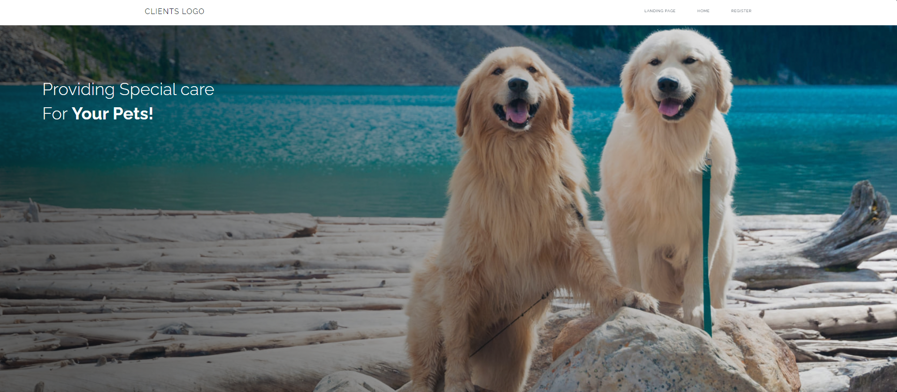
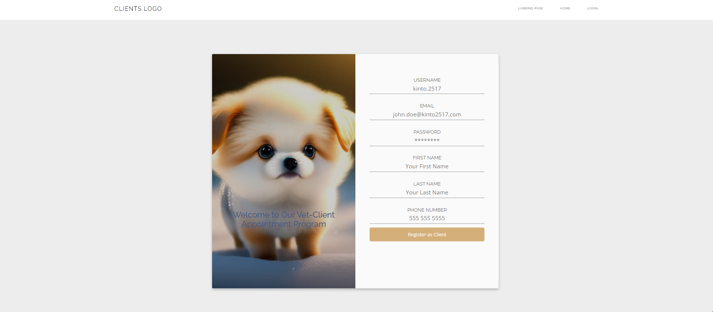
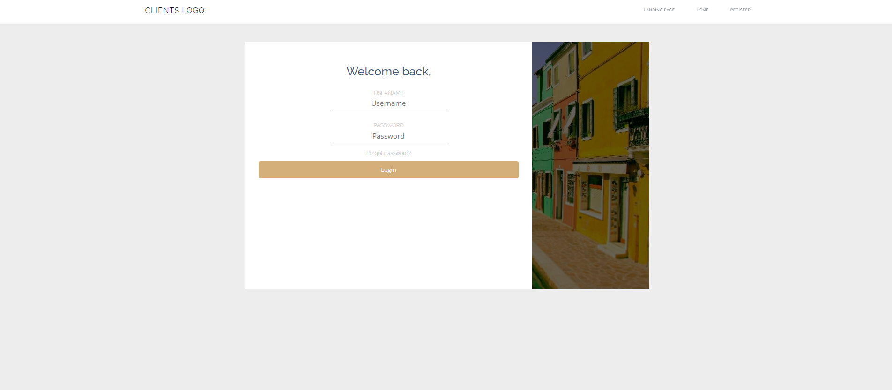
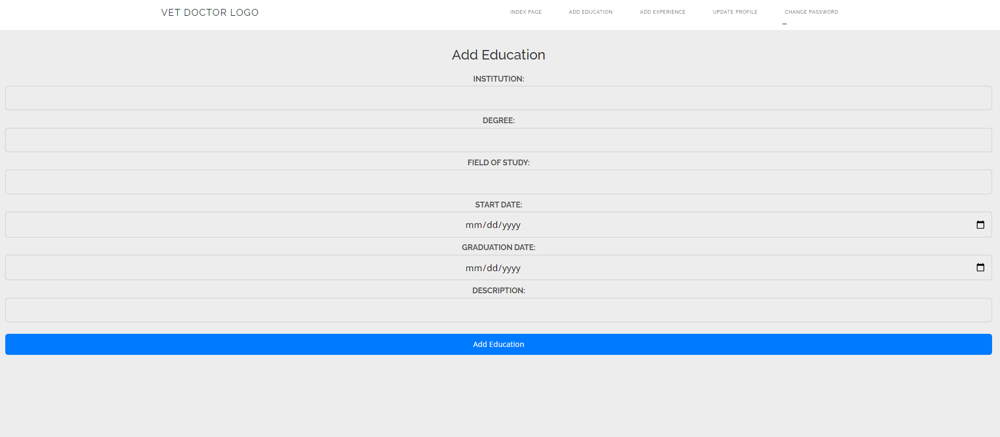

<a name="readme-top"></a>

<details>
  <summary>Table of Contents</summary>
  <ol>
    <li>
      <a href="#about-the-project">About The Project</a>
    </li>
    <li>
      <a href="#getting-started">Getting Started</a>
    </li>
    <li><a href="#built-with">Built With</a></li>
    <li><a href="#usage">Usage</a></li>
    <li><a href="#contributing">Contributing</a></li>
    <li><a href="#contact">Contact</a></li>
  </ol>
</details>


## About The Project

The VetAppointment Frontend is the user interface of the VetAppointment system, designed to provide a seamless and user-friendly experience for both clients and vet doctors. This web application allows clients to schedule appointments, manage their pets, and rate vet doctors, while vet doctors can manage their schedules, view appointments, and receive ratings.

The frontend is built with modern web technologies and offers an intuitive interface that simplifies the interaction between clients and vet doctors. Users can easily register, log in, and access their respective dashboards to perform various tasks, ensuring efficient communication and coordination within the veterinary ecosystem.

The VetAppointment Frontend is an essential component of the VetAppointment system, offering a convenient and accessible platform for users to connect with veterinary professionals and manage their appointments seamlessly. Whether you're a pet owner looking to book appointments or a vet doctor managing your practice, this frontend application has you covered.

<p align="right">(<a href="#readme-top">back to top</a>)</p>

## Getting Started

### Prerequisites

Before you begin, make sure you have the following prerequisites:

* Npm installed in your system.
* Visual Studio Code installed.

### Installation Steps

#### Clone the Repository:

Start by cloning the VetAppointment Backend repository to your local machine.

```
git clone https://github.com/Kinto2517/vet-appointment-frontend.git
```

#### Starting The Project

In the project directory, you can run:

```npm start```

Runs the app in the development mode.

Open [http://localhost:3000](http://localhost:3000) to view it in your browser.

The page will reload when you make changes.

<p align="right">(<a href="#readme-top">back to top</a>)</p>

## Built With

* 
* 
* 
* 

<p align="right">(<a href="#readme-top">back to top</a>)</p>


## Usage

### Note that frontend part of this project is still in developing process and not fully represent the final project.











<p align="right">(<a href="#readme-top">back to top</a>)</p>


## Contributing

Contributions are what make the open source community such an amazing place to learn, inspire, and create. Any contributions you make are **greatly appreciated**.

If you have a suggestion that would make this better, please fork the repo and create a pull request. You can also simply open an issue with the tag "enhancement".
Don't forget to give the project a star! Thanks again!

1. Fork the Project
2. Create your Feature Branch (`git checkout -b feature/AmazingFeature`)
3. Commit your Changes (`git commit -m 'Add some AmazingFeature'`)
4. Push to the Branch (`git push origin feature/AmazingFeature`)
5. Open a Pull Request

<p align="right">(<a href="#readme-top">back to top</a>)</p>


## Contact

* Ersin Yılmaz ASLAN - [My LinkedIn](https://tr.linkedin.com/in/ersinya)
* Project Link: [Vet Appointment Frontend](https://github.com/Kinto2517/vet-appointment-frontend)
* Backend Project Link: [Vet Appointment Backend](https://github.com/Kinto2517/VetAppointmentBackend)

<p align="right">(<a href="#readme-top">back to top</a>)</p>

